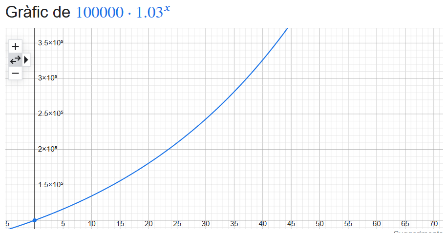
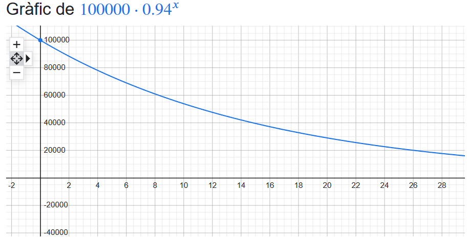
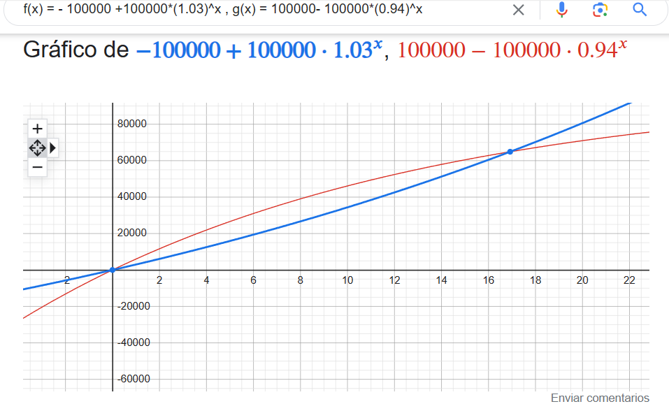

# INTRODUCCIÓN

La inflación es una lacra producida por la impresión sin restricciones de moneda por parte de los bancos centrales (Reserva Federal en EEUU, Banco Central Europeo en Europa, Banco Central de la República Argentina, en Argentina, etc.). Al aumentar la masa monetaria de forma artificiosa para subvencionar el déficit presupuestario de los estados, empresas o individuos, permitiendo que estos se endeuden excesivamente a futuro y que esa deuda se eternalice y nunca se pague, se genera algo inevitable: el incremento de la masa monetaria sin que ello conlleve un incremento parejo de los bienes producidos. Esto, al menos bajo mi leal saber y entender, genera la inflación.

Si se mantuviese durante un período de 10 años la inflación interanual de entorno el 6 por ciento que tenemos ahora a finales de 2023, implicaría inevitablemente que el capital que la gente tenga en liquidez va a reducirse a la mitad. Reitero: <strong>la población española tiene el potencial de perder la mitad de su dinero en 10 años</strong> (o lo que es lo mismo: si hoy 30 000 euros compran un coche, en 10 años se necesitarán 60 000 para comprar un producto con el mismo nivel de correspondencia en la gama del fabricante que hayamos escogido).

Con este repositorio queremos cumplir una triple función: primero, generar una herramienta didáctica con la que poder explicar y calcular visualmente el <strong>interés compuesto</strong> de imposiciones a plazo, bonos del estado u otros instrumentos financieros que generen un retorno fijo anual; segundo, queremos enseñar y calcular visualmente <strong>el efecto que la inflación tiene en nuestro capital</strong> y como este efecto se puede representar mediante una "minoración" de la capacidad de compra de nuestro dinero con el paso de los años; finalmente, queremos proporcionar al lector y al usuario de esta aplicación web una herramienta para entender como evitar el efecto de la inflación sobre nuestros ahorros y así calcular cuántos años son necesarios para que un capital inicial que queremos preservar, al que denominaremos $Q$, no se pierda por efecto de la misma. Con este repositorio demostramos que es posible vencer la inflación si la rentabilidad de las inversiones es inferior a la inflación, mediante el interés compuesto.

La voz popular pone en boca de Einstein la frase: "El interés compuesto es la fuerza más poderosa de la galaxia". En este apartado y el siguiente vamos a ver por qué el interés compuesto es la clave para vencer la inflación.

# FÓRMULAS DE CÁLCULO DEL INTERÉS COMPUESTO

Si hoy tenemos 10 000 euros y ponemos ese dinero en un instrumento de renta fija, variable, etc. de tal modo que nos genere un 3% TIN neto (es decir, después de haber ajustado el TIN bruto a TIN neto descontándole el IRPF correspondiente -que aquí no mostraremos-) tendremos que:

En un año tendremos $Q(1)$:

$$ Q(1) = 10000 \cdot 1.03 = 10300 $$

En dos años nuestro capital habrá ascendido a:

$$ Q(2) = (10000 \cdot 1.03)*1.03= 10609 $$

En tres años:

$$ Q(3) = (10000 \cdot 1.03\cdot 1.03 )  \cdot 1.03 \approx 10927 $$

Y, por lo tanto, siguiendo el razonamiento inductivo es muy fácil ver que la fórmula general para calcular cuánto habrá crecido nuestro capital será simplemente una exponencial con exponente $n$ e interés en tanto por uno $i$, con capital inicial invertido $Q$:

$$ Q(n) = Q \cdot (1+i)^n $$

Si ahora lo que queremos determinar es <strong>solamente</strong> las ganancias netas a medida que van pasando los años podemos escribir la siguiente función $Q_{g}(n)$, que nos servirá para calcular el momento exacto en el que nuestras inversiones, de mantener un interés anual $i$ que sea compuesto año tras año, podrán vencer la minoración que la inflación produce sobre ese mismo capital (concretamente, es la función anterior a la que le restamos el capital inicial $Q$).

$$ Q_{g}(n) = Q \cdot (1+i)^n - Q$$

# FÓRMULAS DE CÁLCULO DE LA INFLACIÓN

El cálculo de la inflación es algo de lo que solamente se habla con respecto al año anterior (el IPC interanual, el IPC mensual...) No hay mucha información en el saber popular sobre el impacto que tiene la misma a lo largo de múltiples años a pesar del efecto devastador que tiene en la economía de los ahorradores como se ha especificado en la introducción. Se me ocurre hacer una estimación de cálculo de la misma en función del número $n$ de años que pasan, mediante dos funciones distintas, muy parecidas a la fórmula del interés compuesto.

## Forma 1

De forma análoga a lo que pasaba con el interés compuesto, la inflación funciona de forma similar. Con la fórmula de cálculo 1, que denominaremos $Q_{inf}(n)$, si tenemos 10 000 euros y el dinero no está invertido con una inflación de 6%  de interés interanual el capital iría variando:

En un año podríamos comprar con 10 000 euros lo que ahora compraríamos con $Q_{inf}(1)$:

$$ Q_{inf}(1) = 10000 \cdot 0.94 = 9400 $$

En dos años nuestro capital habrá minorado a:

$$ Q_{inf}(2) = (10000 \cdot  0.94)* 0.94 = 8836 $$

Quedando reducido el tercer año en:

$$ Q_{inf}(3) = (10000 \cdot 0.94\cdot 0.94 )  \cdot 0.94 \approx 8305.84 $$

Y, por lo tanto, siguiendo el razonamiento inductivo, igual que antes, es muy fácil ver que la fórmula general para calcular cuánto habrá decrecido nuestro capital por la inflación es usar una función donde a nuestro capital inicial $Q$ lo multiplicamos por un "descuento" anual, al que denominaremos $1 - i^{'}$, donde i' será el que yo denomino "interés inflacionario" del dinero o, el que en españa sería el IPC, según la siguiente expresión $Q_{inf}(n)$ (de cantidad -quantitat del catalán- inflacionada):

$$ Q_{inf}(n) = Q \cdot (1-i^{'})^n $$

Para esta forma de cálculo podemos sacar las "pérdidas" inflacionarias a lo largo de los $n$ que pasan, de forma análoga a como hicimos con las la fórmula de variación del capital mediante interés compuesto $Q(n)$ mediante la expresión de ganancias del interes compuesto $Q_{g}(n)$, pero ahora generando la función $Q_{p[Inf]}(n)$ (<strong>cantidad de pérdidas inflacionarias en función del número de años</strong>) que proponesmos a continuación:

$$ Q_{p[Inf]}(n) = Q - Q \cdot (1-i^{'})^n $$

Siendo esta fórmula de cálculo idéntica a la que implementan los desarrolladores en la aplicación bancaria de BBVA, al menos, a fecha de septiembre-octubre de 2023.

## Forma 2

La otra forma de calcular la inflación, a la que denominaremos  $Q^{'}_{inf}(n)$, es tomando la fórmula del interés compuesto clásica $Q(n)$ pero modificarla de tal modo que en lugar de multiplicar la cantidad incial $Q$ por el factor $(1 + i)^n$, la divida (que es como algunas calculadoras online están implementadas, al menos a octubre de 2023, como, por ejemplo, esta página web de reino unido: ([wesleyan.co.uk](https://www.wesleyan.co.uk/savings-and-investments/inflation-calculator)): 

$$ Q^{'}_{inf}(n) = \dfrac{Q}{(1+i^{'})^n} $$

Y para las pérdidas:

$$ Q_{p'[Inf]}(n) = Q - \dfrac{Q}{(1+i^{'})^n} $$

## FORMA 1 VS FORMA 2 (¿cuál es mejor?)

Ambas formas de cálculo de la inflación parecen efectivas. Son muy parecidas, pero no son iguales. Para todo valor de $n > 0$ vemos que la <em>forma 1</em> implica estimar mayores pérdidas por inflación con el paso del tiempo que la <em>forma 2</em> ya que tenemos:

$$Q_{inf}(n) < Q^{'}_{inf}(n)$$

$$Q \cdot (1-i^{'})^n \lt \dfrac{Q}{(1+i^{'})^n}$$

 Por lo tanto, aunque ambas funciones puedan ser buenas candidatas para estimar la inflación, para las estimaciones inflacionarias tomaremos la <em>forma 1</em>, es decir $Q_{inf}(n)$ y su variante para calcular pérdidas $Q_{p[Inf]}(n)$, por ser <strong>más conservadora</strong>.

# CÁLCULOS DE NUESTRO PROGRAMA

La idea de nuestro programa es hacer una aplicación web que dada una inflación entrada por el usuario y un tipo de interés que el mismo pueda ganar con sus inversiones, muestre:

1) Un gráfico de como <underline>incrementa el capital</underline> con el <strong>interés compuesto</strong>.

2) Un gráfico que muestre como <underline>"decrementa" el capital</underline> debido a la <strong>inflación</strong>: este gráfico podremos mirarlo como "<i>con la inflación que ha habido desde ahora hasta mismo hasta un determinado año $n$ cuántas cosas podré comprar en ese año futuro $n$ con exactamente el mismo número de euros que tengo hoy, si quisierlas compralas hoy</i>". Es decir, si tengo 10 000 euros y la inflación es de un  100 por ciento al año, el año que viene seguiré teniendo 10 000 euros, sí, pero solo podré comprar lo mismo que hoy comprarían 5 000 euros (porque en un año, de media, las cosas van a costar el doble).

3)  un gráfico que represente nuestras ganancias año a año, por un lado; y nuestras pérdidas por inflación en valor absoluto también año a año, por el otro. Además, sería interesante que muostrase una aproximación al punto de corte de ambas funciones de forma análoga a como lo hace google con su sistema. Este punto tres es algo inédito que no hemos visto en ninguna función de cálculo para la inflación. Y hay que añadir algo MUY importante: nótese que crece más rápido la función que incrementa el dinero con interés compuesto ( $Q(n)$ ) que no lo rápido que decrece la función que muestra el decrecimiento por inflación ( $Q_{inf}(n)$ ). Por lo tanto, y por poner un ejemplo, con un interés medio del 3 por ciento que se puede obtener ahora mismo en depósitos españoles podemos vencer una inflación del 6 por ciento, en 17 años, si lo hacemos bien tomando beneficios del interés compuesto.

## GRÁFICO DE VARIACIÓN DEL CAPITAL POR INVERSIÓN

En la aplicación web queremos mostrar $Q(n)$, de forma análoga a como lo muestra google. Para $Q = 100 000$ euros de capital inicial y un interés compuesto $i = 0.03$ (3%) la función exponencial en el buscador queda de este modo:

Y en nuestra aplicación web queda así:

TO DO

## DISMINUCIÓN DEL CAPITAL POR INFLACIÓN (SIN INVERTIR EL CAPITAL)

En la aplicación web queremos mostrar la función $Q_{inf}(n)$, como google. Igual que en el caso anterior, para 100 000 euros de capital inicial y para $i^{'} = 0.06$ (inflación del 6%) en el buscador queda:

Y en nuestra aplicación queda así:

TO DO

## REPRESENTACIÓN DEL GRÁFICO DE INCREMENTO DE RENTA VS GRÁFICO DE DECREMENTO INFLACIONARIOS

En la aplicación web también queremos mostrar la función de ganancias acumuladas a lo largo de los años $Q_{g}(n)$ (en azul) en relación a las pérdidas producidas por la inflación en un capital que no obtiene rentabilidad $Q_{p'[Inf]}(n)$ (en rojo), de la misma forma que lo muestra google. Por ejemplo, para una cantidad inicial $Q$ de 100 000 euros google nos muestra:

En este gráfico la importancia está encontrar el momento en que se produce el punto de corte entre ambas funciones, como veremos en el siguiente apartado.

## CÁLCULO DEL PUNTO DE CORTE DEL GRÁFICO DE INCREMENTO DE RENTA Y EL GRÁFICO DE DECREMENTO INFLACIONARIO

Como decíamos en el apartado anterior, el punto de corte entre las funciones $Q_{g}(n)$ y $Q_{p'[Inf]}(n)$ es importante porque el número de años (variable $n$) al que ambas funciones cortan es el número de años que hay que estar invertiendo el dinero con interés compuesto $i$ para no perderlo por una supuesta inflación constante $i'$.

Para encontrar el punto de corte podríamos tratar de sustituir los valores $i$ e $i^{'}$ tanto en la función que hemos visto para las ganancias de los intereses ( $Q_{g}(n)$ ) y para la función de pérdidas producidas por la inflación mediante la FORMA 1 de cálculo ( $Q_{p[Inf]}(n)$ ), respectivamente. Igualándolas podemos intentar obtener n en función de $i$ y de $i^{'} ( $n(i,i^{'}) )$ manipulando algebraicamente:

$$Q_{g}(n) = Q_{p[Inf]}(n)$$

Es decir:

$$Q \cdot (1+i)^n - Q = Q - Q \cdot (1-i^{'})^n$$

Operando en la expresión anterior, podemos acercarnos a la obtención de $n(i,i')$ (n en función de $i$ e $i'$ ):

$$Q \cdot (1+i)^n - Q = Q - Q \cdot (1-i^{'})^n$$

$$Q \cdot (1+i)^n - 2Q = - Q \cdot (1-i^{'})^n$$

$$-(1+i)^n + 2 = (1-i^{'})^n$$

$$(1-i^{'})^n + (1+i)^n = 2$$

Para obtener la expresión $n(i,i^{'})$ (n en función del interés de la inversión $i$ y de la inflación $i^{'}$ ) como deseábamos con la última ecuación nos hemos dado cuenta que no se puede conseguir mediante técnicas numéricas algebraicas tradicionales; son necesarias técnicas computacionales o métodos numéricos para obtenerla[^1]. Hemos usado la representación de funciones de google para que en una inflación del 6% ( $i^{'}=0.06$ ) y un interés en las inversiones del 3% ( $i^{'}=0.03$ ) en cuántos años $n$ podremos vencer la inflación tratando de solucionar la expresión:

$$ (1 - 0.06)^n + (1 + 0.03)^n = 2$$
$$ 0.94^n + 1.03^n = 2$$

Y el resultado ha sido el siguiente:

$$n = 16.922$$

Es decir, con la inflación al 6% anual y las inversiones en interés compuesto rindiendo un 3% anual <strong>podemos vencer la inflación en poco menos de 17 años, independientemente de la cantidad inicial $Q$ que tengamos</strong>.

# CONCLUSIONES

<strong>TO DO</strong>

[^1]: Un método numérico para hallar n, con el resto de valores conocidos es usar el método de bisección.Es una una espécie de búsqueda dicotómica en la que vamos aproximando de forma tentativa la solución a la ecuación.